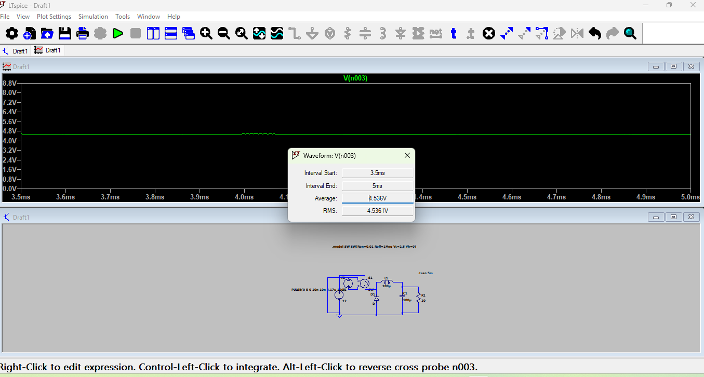
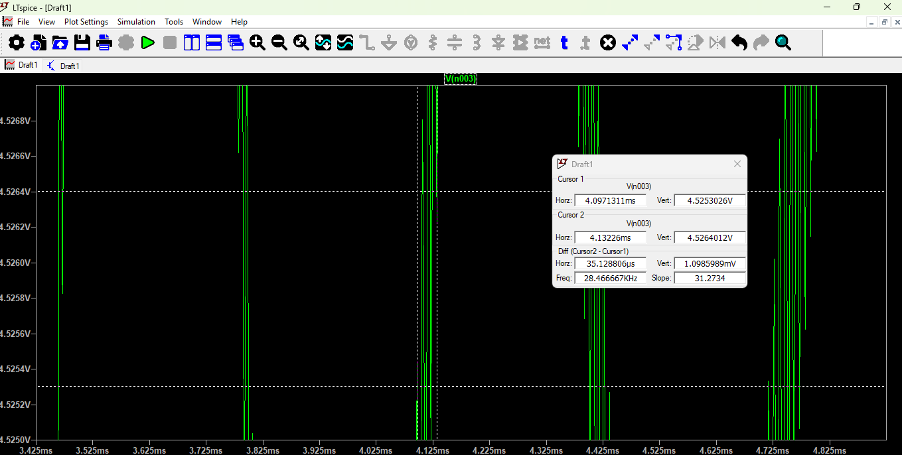
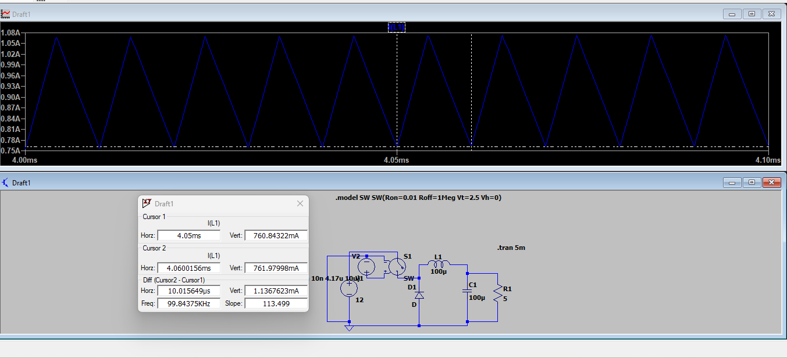
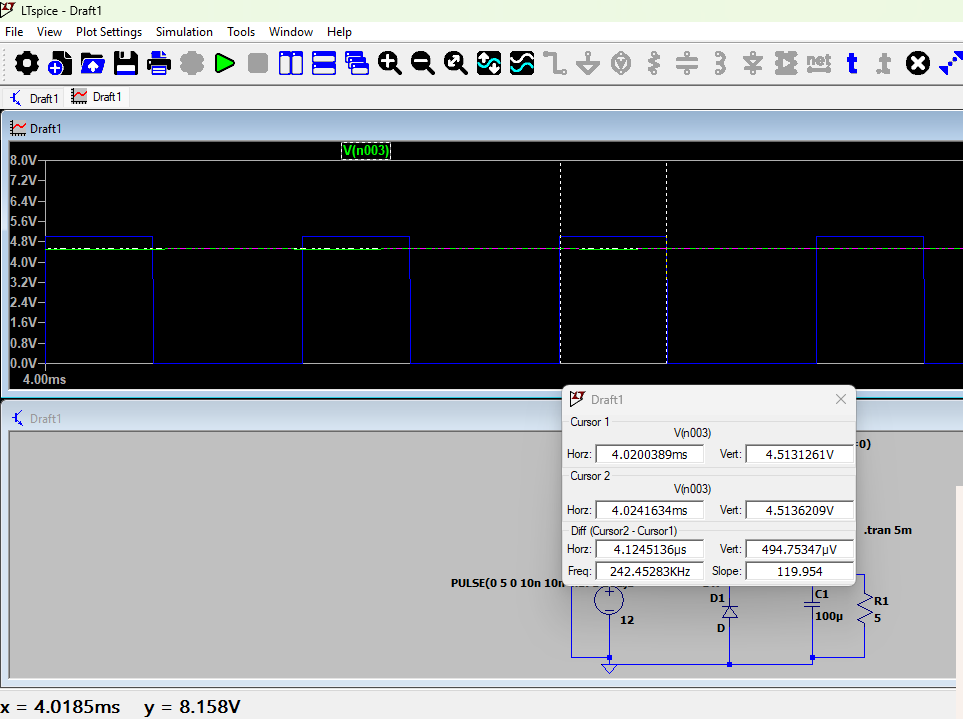
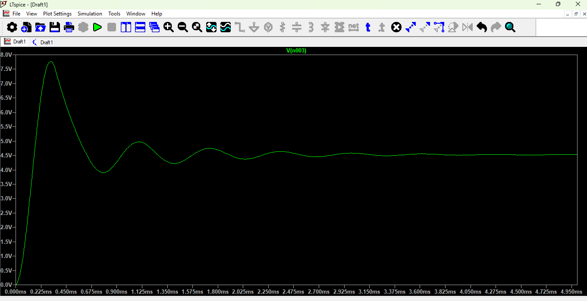

# DC-DC Buck Converter Design and Simulation

**12 V Input → ~4.52 V Output | 100 kHz | 41.7% Duty Cycle | ~88.9% Efficiency**

## Overview

This project demonstrates the design and simulation of a DC-DC buck converter in LTspice. The converter steps down a 12 V DC input to approximately 4.52 V using PWM-controlled switching.

The circuit was analyzed for output voltage, voltage ripple, inductor current, switching frequency, startup response, and overall efficiency.
## Circuit Parameters

| Parameter | Value |
|---|---|
| Input Voltage | 12 V |
| Switching Frequency | 100 kHz |
| Duty Cycle | 41.7% |
| Inductor | 100 µH |
| Output Capacitor | 100 µF |
| Load Resistance | 5 Ω |

## Simulation Results

| Measurement | Result |
|---|---|
| Average Output Voltage | ≈ 4.52 V |
| Average Load Current | ≈ 0.903 A |
| Average Inductor Current | ≈ 0.916 A |
| Inductor RMS Current | ≈ 0.920 A |
| Inductor Current Ripple | ≈ 0.310 A p-p |
| Output Voltage Ripple | ≈ 3.14 mV p-p |
| Output Ripple Percentage | ≈ 0.0695% |
| Average Input Current | ≈ 0.383 A |
| Input Power | ≈ 4.59 W |
| Output Power | ≈ 4.08 W |
| Simulated Efficiency | ≈ 88.9% |

## PWM Control
The converter uses a PWM signal with a period of 10 µs and an ON time of approximately 4.17 µs.

Switching frequency:

f = 1 / T = 1 / (10 µs) = 100 kHz

Duty cycle:

D = Ton / T = 4.17 / 10 = 41.7%

## Tools
- LTspice
- GitHub

## Files
`Buck_Converter.asc` contains the LTspice schematic and simulation setup.

## What I Learned
This project helped demonstrate the relationship between PWM duty cycle, energy storage components, switching frequency, output ripple, and the performance of a DC-DC buck converter.

## Simulation Results

### Output Voltage

### Output Voltage Ripple

### Inductor Current

### Switching Frequency

### Switching Waveform

### Startup Response

